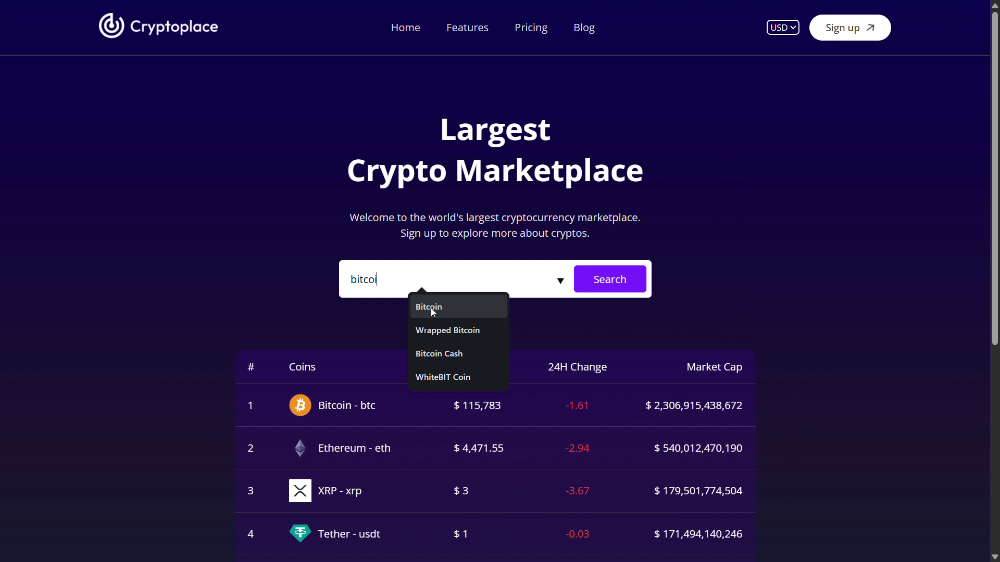
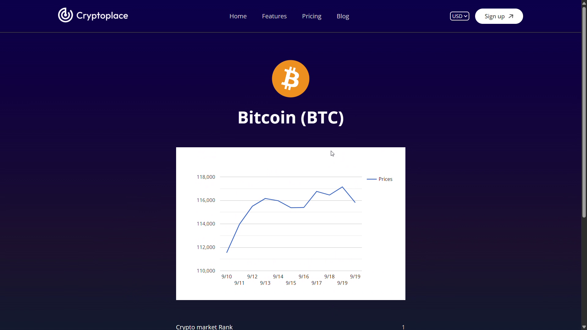

# 🚀 CryptoPlace – Cryptocurrency Tracker Web App

CryptoPlace is a modern, responsive React web application that lets users explore real-time cryptocurrency market data. It provides a clean interface to track prices, market cap, and 24h performance of top cryptocurrencies.

---

## ✨ Features
- 📊 **Live Market Data** – Fetches real-time cryptocurrency data using the CoinGecko API.
- 🔍 **Search & Filter** – Quickly search for any cryptocurrency by name or symbol.
- 📈 **Price & Market Stats** – Displays price, 24h change %, market cap, and volume.
- 🌙 **Dark/Light Mode** – Toggle between light and dark themes.
- 📱 **Responsive Design** – Optimized for desktop, tablet, and mobile screens.
- ⚡ **Fast & Optimized** – Built with Vite for super-fast builds and performance.

---

## 🛠 Tech Stack
- **Frontend:** React + Vite
- **Styling:** CSS / Tailwind (if used)
- **State Management:** React Hooks / Context API
- **API:** [CoinGecko API](https://www.coingecko.com/en/api)
- **Deployment:** Render / GitHub Pages (or your chosen platform)

---

## 📸 Demo / Screenshots

Example:

| **Dashboard Page** | **Coin-Detail Page** |  
|-------------------|--------------------|  
|  |  |  

---

## ⚡ Installation & Setup

Follow these steps to run the project locally:

```bash
# 1️⃣ Clone the repository
git clone https://github.com/Chetanmore4596/cryptoplace.git

# 2️⃣ Navigate to the project folder
cd cryptoplace

# 3️⃣ Install dependencies
npm install

# 4️⃣ Start the development server
npm run dev


---

## 🧑‍💻 Devloped By  

👤 **Chetan More**  
🔗 [LinkedIn](https://www.linkedin.com/in/chetan-more-b489b02a8) 

